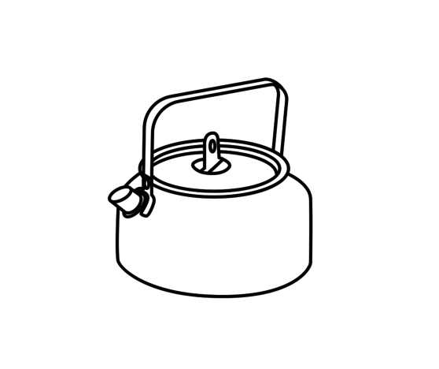

# How to listen

## It’s not all about the ears:

When someone is living in a violent or abusive relationship, it is often difficult for them to speak about it with other people. They can be scared of being judged and accused of lying. They might feel forced into having to prove to others that they are in fact telling the truth or even embarrassed or ashamed to be in an abusive relationship.
 
There are many forms of abuse (physical, verbal, psychological, emotional, sexual) and when someone is  living through it, it is not always easy to recognise abuse for what it is. The first step to someone leaving a violent or abusive relationship is to be able to acknowledge it. Speaking about what they are going through, even if it confuses them, is one way to share their feelings that things aren’t going well or as they should. How a friend listens to these stories is of key importance. 

  

## Tips

  Listen patiently. Do not interrupt or force your own opinions on your friend. It is normal to have an urge to do so because you want to get them out of this situation as quickly as possible. Yet, you risk shutting them down and stopping them from speaking to you openly in the future.

-     Wait and respect the time they take to tell you their story. Your friend may not be ready to tell you everything that has happened to them in the first sitting.

-Be sensitive to the surroundings in which you meet and talk. Try tomeet in a quiet place which is neutral enough to help them talk about such difficult issues. Your friend may not want to talk about it in public, so perhaps go for a walk or do an activity - like cooking together. It is sometimes easier to talk when you are not just staring at one another across a table.

-     Do not judge. Your opinion is important but you shouldn’t make your friend feel judged. Try to maintain a conversation that allows them to speak freely. Ask open-ended questions that encourage them to elaborate on their situation and describe their experiences. For example, you can simply ask “How are you?” or “I’d love to hear what is going on. Would you like to share with me?”. You can also mirror back what they are saying, using phrases such as “It sounds like you are…” or “From what I understand you are saying that…” You may also try to avoid questions that require your friend to justify their experiences, such as those that start with “why…?”. 

- Listen and be careful about what you say. Remember that your friend may have positive feelings such as love for their abuser. Attacking their abuser may cause your friend to become defensive and/or shut down.

-     Try to work out if your friend is in danger. Listen carefully and sensitively to what your friend is telling you. Try to assess carefully if they are in danger, but make sure not to scare or panic them. You will find sources at the end of this guide presenting the signs you should look out for.

-     Speak to your friend regularly. Do not let too much time pass between the occasions that you speak to your friend about their situation. Try to do this without being intrusive, and instead aim to create a safe space where they can speak to you in confidence.

-     Recommend your friend to speak to other people, but only if it is safe to do so. It is really important that in order to prevent increasing risk, they only tell sensitive information to people they know they can trust, especially if the individuals they are unsure about are connected to their abuser or the abuser’s family. One way of testing people is to entrust them with a small, innocent secret and wait to see if they break your friend’s trust. If they do, your friend will know not to trust them. If their family, friends and co-workers are supportive, then you can encourage your friend to build a network of trust.  This will help them to get the support and protection they might need.

-     Speak to someone. Once your friend has confided in you about their situation you will need support too. While you are helping your friend through this difficult situation, it's important to take care of your own mental health in the process. You may feel frustrated and powerless if you try to resolve the situation alone. 

-     Choose carefully who you speak to. Speak to someone who you can trust and who may help you to understand how to go forward. Make sure not to speak to someone who is also close to your friend in need, or someone who they may not want to confide in. 

-     Do not speak about the situation to your friend’s partner. You cannot resolve the situation by mediating between your friend and their partner. You must not tell their partner what they have told you. Doing so can endanger your friend and may make their situation more difficult. Above all, you are likely to lose your friend’s trust.

-     Remember that you can seek professional support. It can be very emotionally difficult to support a friend in a violent relationship. If the situation continues, remember that it is not your fault. There are a variety of professional support networks to protect people in violent relationships. You can contact them for advice and to talk about your feelings. They are available for people in both homo- and heterosexual relationships. We are aware that  these support structures might not exist or might be difficult to access from where you live and that this is a hard situation to be in. In this case, there might be other resources you can access over the internet, like online counselling or chat rooms. For example, have a look at [7 Cups of Tea](http://www.7cups.com) or look at the end of this guide for more resources. 

  
At Chayn, we offer platforms that are designed to help people experiencing domestic abuse in different regions of the world, visit our local chapters [Chayn Pakistan](http://chaynpakistan.org/), [Chayn India](http://chaynindia.com/), [Chayn Italia ](http://chaynitalia.org/)and our platform [Supernova Project](http://supernovaproject.org/) for information related to domestic abuse within LGBTQIA+ relationships and links to helpful organisations close to where you live.
