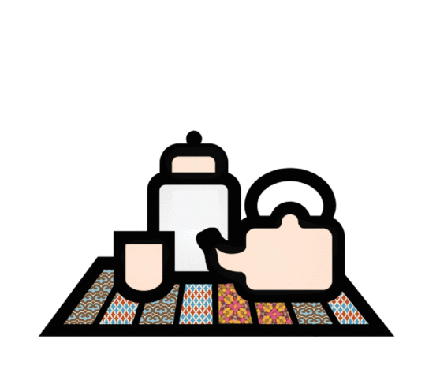

# the Good Friend guide

### how to be supportive to a friend or family member experiencing abuse

This guide is intended to give practical and simple advice to the general public, particularly for those looking to support a friend in an abusive relationship. We are not suggesting that this guide provides all the answers for each individual case. There is no one-size-fits-all solution that works for supporting everyone who is experiencing abuse.

For now we have decided to focus our attention on violent and abusive relationships in which the victim is a woman. The relationships may be homo- or heterosexual. Although [CHAYN’s](http://chayn.co) work is mostly aimed at women, the advice we give in this guide can be used by anyone who believes it can be helpful to them, regardless of gender.

At the end of this guide you will find a number of resources with more in-depth information about signs to look out for to help recognise an abusive relationship, and possible support schemes or organisations to contact.
 
This guide is part of a continuing discussion about how we can support women in violent relationships. We welcome suggestions and contributions that will help us improve this guide. The guide was originally developed by Cagnesciolte in Rome and has been remixed by [CHAYN](http://chayn.co).
