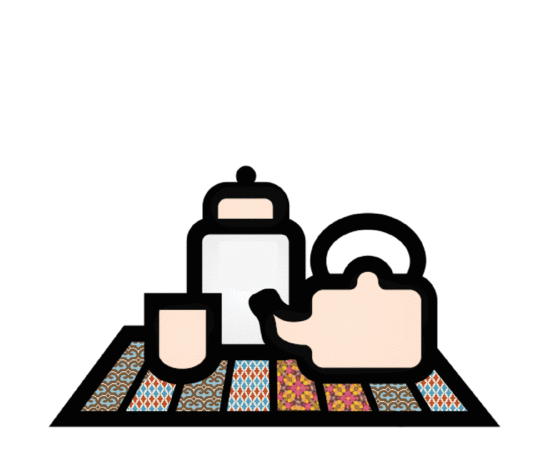

# Introduction

## How to be supportive to a friend or family member experiencing abuse.

Are you looking for practical and simple advice on how to better support a friend in an abusive relationship? This is a short guide that will do just that. If you’re not sure how to spot signs of abuse, you can also read our other guide: [Manipulation is abuse](https://chayn.gitbooks.io/manipulation-is-abuse/content/what_does_manipulation_look_like.html). Though this is not a definitive resource with all the answers for each individual case, it’s a good place to start especially if you’re feeling unsure or anxious. Don’t worry! You can do this. There is no one-size-fits-all solution so only follow the advice within this guide that feels right in your situation.

For now, we have decided to focus our attention on violent and abusive relationships in which the survivor is a woman or non-binary person. The relationships may be heterosexual or same-sex. Although [CHAYN’s](http://chayn.co/) work is mostly aimed at women and non-binary people, the advice given in this guide can be used by anyone who believes it can be helpful to them, regardless of gender.

This guide is part of a continuing discussion about how we can support those in violent relationships. We welcome suggestions and contributions that will help us improve this guide.






