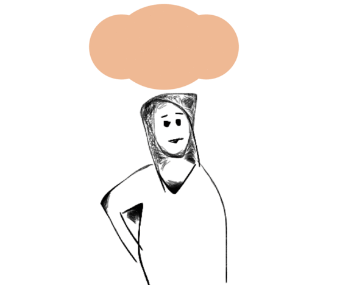

# If they return to abuser

You may find that you help your friend leave an abusive relationship, but they end up returning to them a few months, weeks or even years later. We need to be a strong support network for a friend suffering from abuse. Therefore, it is essential to understand the many factors that pull people back to a relationship that is physically or psychologically harmful:

**Love** – this factor may be extremely difficult for friends and family to understand. How can someone still love a partner who is abusive? The fact is that abuse rarely starts at the beginning of a relationship. Your friend will have gone through what’s called a ‘honeymoon period’ where the abuser was charming, attentive and loving. This period may repeat itself during the relationship, in between experiences of abuse. Once someone is in love, it is hard to break that bond. This is especially true when the abuser is a parent of their children.

**Children** – survivors of abuse are often convinced by their abusive partner that they are worthless and a bad parent. They will constantly be told that if they leave, they will never see their children again. Although this may not be true, abusers can manipulate your friend emotionally and mentally until they believe everything they say. Also, many people believe that they should keep the family together. They may also believe it is the best thing to avoid children growing up with just one parent, having to move schools and often move far from where they live.

**Finance** – survivors of abuse will often be denied access to bank accounts and they are often manipulated into leaving work. This means that once they are out of the relationship they have no financial stability. This can cause people to return to their abusive partner because it is better than being homeless – again this is particularly difficult when children are involved.

**Mental health issues** – the trauma of physical and/or mental abuse could cause your friend mental health problems such as Post Traumatic Stress Disorder \(PTSD\) and depression. Your friend’s abusive partner may have used this to manipulate them. For example, they may deny them essential medication or make your friend dependent on their support.

